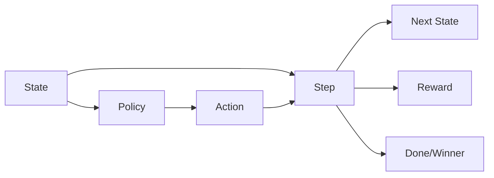
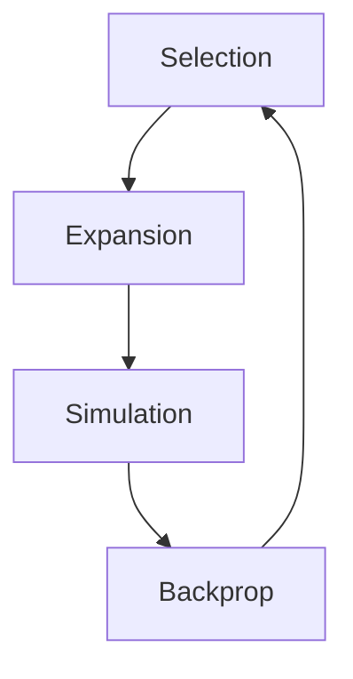

# 三目並べ（MCTS準備）で学んだ設計メモ

## 設計の分離
- **状態（state）**: `grid + turn` を1つの単位として扱う。
- **policy**: `state -> action` だけを返す。
- **step**: `state + action -> next_state, reward, done, winner` を返す。
- これにより「人間 / ランダム / MCTS」を同じインターフェースで切り替えられる。

最小の流れ:
```text
action = policy(state, mode)
next_state, reward, done, winner = step(state, action)
state = next_state
```

Mermaid 図（データフロー）:


## グローバルをやめる理由
- MCTSでは「状態を分岐して試す」必要がある。
- そのため **状態は不変**にし、`next_state` を新しく作って返す形が安全。
- `grid` をグローバルに書き換えると探索が壊れる。

不変な設計のイメージ:
```text
old_state --(action)--> new_state
old_state は変更しない
```

## 状態のコピー
- `states.append((grid.copy(), turn))` のように **盤面は必ずコピー**。
- 参照を入れると全履歴が最後の盤面に崩れる。

## 勝敗判定
- `game_result(grid) -> (done, winner)` として **引数で受ける**形に統一。
- `done` と `winner` を分けると制御が明確になる。

返り値のイメージ:
```text
done: True / False
winner: 1 (X) / -1 (O) / 0 (no winner yet or draw)
```

## 合法手（gohote）
- 空きマス一覧 `gohote` は**状態から計算**する。
- `policy` は原則 **合法手だけ返す**。
- `step` 側に最終チェックを入れると安全（MCTSやランダムにも効く）。

合法手の取得:
```text
gohote = [i for i in range(9) if grid[i] == 0]
```

## 入力（プレイヤー）
- 入力は `try/except` で **型変換を保護**。
- 範囲チェックは `if` で行い、合法手に含まれない場合は再入力。
- `except` は変換失敗に限定するのが読みやすい。

入力処理の流れ:
```text
try:
  r, c を int に変換
  te = r*3 + c
  te が gohote にあるか確認
  OKなら break
except:
  再入力
```

## 盤面表示の罠
- 表示ずれは **文字幅の差や見えない文字**が原因になりやすい。
- 表示記号は **ASCIIで統一**（例: `X/O/.`）。

## ループの責務
- ループ側は「state更新」「表示」「終了判定」だけに集中。
- 盤面の更新や勝敗判定は `step` と `game_result` に閉じ込める。

ループの役割:
```text
while not done:
  action = policy(...)
  next_state, reward, done, winner = step(...)
  state = next_state
  表示・ログ
```

## 次に必要なMCTSの部品
- Selection（UCT）
- Expansion（未展開手を追加）
- Simulation（ランダムプレイアウト）
- Backprop（結果を伝播）

MCTSの流れ:


この設計にすると、MCTSや強化学習へ拡張しやすい。
